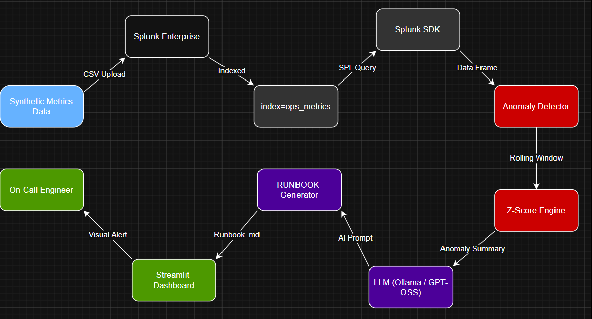

# 🤖 Ops Autopilot — AI-Powered Incident Detection Agent

> **Splunk Agentic Ops Hackathon 2026 — Observability Track**

## 🚨 The Problem

Engineering teams lose hours every day to alert fatigue. When a CPU spike, memory leak, or traffic surge hits production, on-call engineers must manually dig through dashboards, correlate metrics, and figure out what happened — often at 3 AM. Mean Time to Detect (MTTD) and Mean Time to Resolve (MTTR) suffer as a result.

## ✅ The Solution

**Ops Autopilot** is an AI agent that watches your Splunk metrics 24/7, automatically detects anomalies using statistical analysis, and instantly generates a plain-English incident runbook telling your engineer exactly what happened, why, and what to do — in under 5 seconds.

No manual triage. No alert fatigue. Just answers.

---

## 🏗️ Architecture



### Data Flow
1. System metrics (CPU, memory, request rate, error rate) are ingested into **Splunk Enterprise** via the `ops_metrics` index
2. The **Python agent** queries Splunk every 60 seconds using the Splunk SDK
3. The **Anomaly Detector** applies z-score analysis with a rolling window to identify statistical outliers
4. Detected anomalies are passed to the **LLM Runbook Generator** (Ollama / GPT-OSS)
5. The AI generates a structured incident runbook with root cause analysis and remediation steps
6. The **Streamlit Dashboard** displays live metrics, anomaly markers, and the latest runbook in real time

---

## 🧠 Splunk AI Capabilities Used

| Capability | How Used |
|---|---|
| Splunk Enterprise | Core data platform — indexes and stores all metrics |
| Splunk SDK (Python) | Agent queries metrics via SPL in real time |
| Splunk AI Toolkit | ML foundation for anomaly detection pipeline |
| GPT-OSS / Ollama | LLM generates plain-English incident runbooks |
| SPL (Search Processing Language) | Powers all metric queries and aggregations |

---

## 📁 Project Structure

```
ops-autopilot/
├── agent/
│   ├── splunk_client.py    # Splunk SDK connection and SPL queries
│   ├── anomaly.py          # Z-score anomaly detection engine
│   ├── runbook.py          # LLM-powered runbook generator
│   └── main.py             # Agent orchestrator — runs the detection loop
├── dashboard/
│   └── app.py              # Streamlit live monitoring dashboard
├── data/
│   ├── generate_metrics.py # Synthetic metrics data generator
│   └── metrics.csv         # Sample dataset (48h, 2880 rows)
├── runbooks/               # Auto-generated incident runbooks (.md)
├── docs/
│   └── architecture.png    # System architecture diagram
├── .env.example            # Environment variable template
├── requirements.txt        # Python dependencies
└── README.md               # This file
```

---

## ⚙️ Setup Instructions

### Prerequisites
- Python 3.10+
- Splunk Enterprise (free trial or developer license)
- Splunk AI Toolkit installed in Splunk
- Ollama installed locally (for LLM runbook generation)

### 1. Clone the repository
```bash
git clone https://github.com/YOUR_USERNAME/ops-autopilot.git
cd ops-autopilot
```

### 2. Create virtual environment
```bash
python -m venv venv
# Windows:
venv\Scripts\activate
# Mac/Linux:
source venv/bin/activate
```

### 3. Install dependencies
```bash
pip install -r requirements.txt
```

### 4. Configure environment variables
```bash
cp .env.example .env
# Edit .env with your Splunk credentials
```

### 5. Generate and ingest sample data
```bash
python data/generate_metrics.py
# Then upload data/metrics.csv to Splunk via Settings → Add Data → Upload
# Set index to: ops_metrics
```

### 6. Install and start Ollama (for AI runbooks)
```bash
# Download from https://ollama.com
ollama pull llama3.2
ollama serve
```

### 7. Run the agent
```bash
python agent/main.py
```

### 8. Launch the dashboard
```bash
streamlit run dashboard/app.py
```

Open your browser at `http://localhost:8501`

---

## 🎯 How It Works

### Anomaly Detection
The agent uses a **rolling z-score algorithm** — for each metric, it computes a rolling mean and standard deviation over a 60-minute window. Any data point more than 2.5–3.0 standard deviations from the mean is flagged as anomalous. This approach requires zero model training and works on any time-series data out of the box.

### AI Runbook Generation
When anomalies are detected, their summary (metric name, peak value, z-score, timestamp) is passed to an LLM with a structured SRE prompt. The model returns a formatted runbook covering: incident summary, root cause analysis, immediate actions, Splunk investigation queries, and escalation criteria.

### Deduplication
The agent tracks the last processed anomaly summary and skips runbook generation if the same anomalies are detected again — preventing duplicate alerts during sustained incidents.

---

## 📊 Demo

🎥 **Demo Video:** [YouTube Link]

---

## 🛠️ Tech Stack

- **Splunk Enterprise** — observability data platform
- **Splunk AI Toolkit** — ML and AI capabilities
- **Python 3.12** — agent and dashboard
- **Splunk SDK for Python** — Splunk API integration
- **Streamlit** — real-time dashboard UI
- **Plotly** — interactive metric charts
- **Ollama + LLaMA 3.2** — local LLM for runbook generation
- **Pandas / NumPy** — data processing and anomaly detection

---

## 📄 License

MIT License — see [LICENSE](LICENSE) for details.